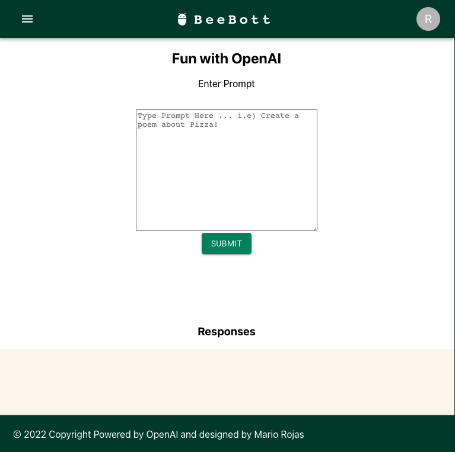
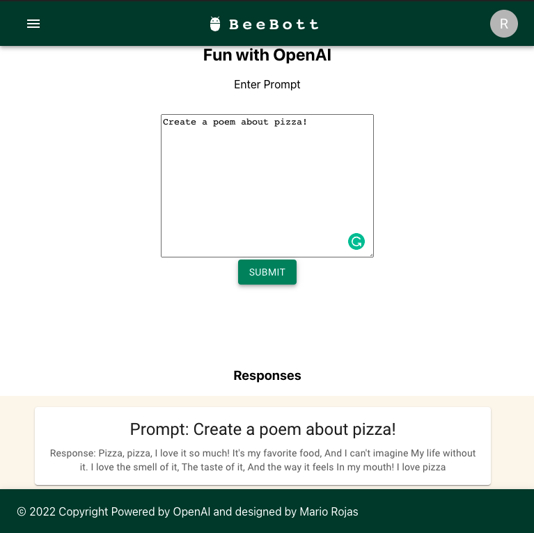

# BeeBot
An AI that takes in prompts and responds based on the input. 

### [Click here for the live app!](https://openaichallenge.netlify.app/)
# Technologies Used
- React
- JavaScript
- HTML
- CSS
- Material UI

# Screenshot(s)

# Getting Started
After downloading repo. 

Make sure Dependacies are installed by running...
### - npm install

Then sign up for a OpenAi Api token key

After that, you can start your app with 

### - npm start

# Unsolved issues
- Adding local storage

# Future Enhancements
- Chat bot functionality.
- Sign up page 
